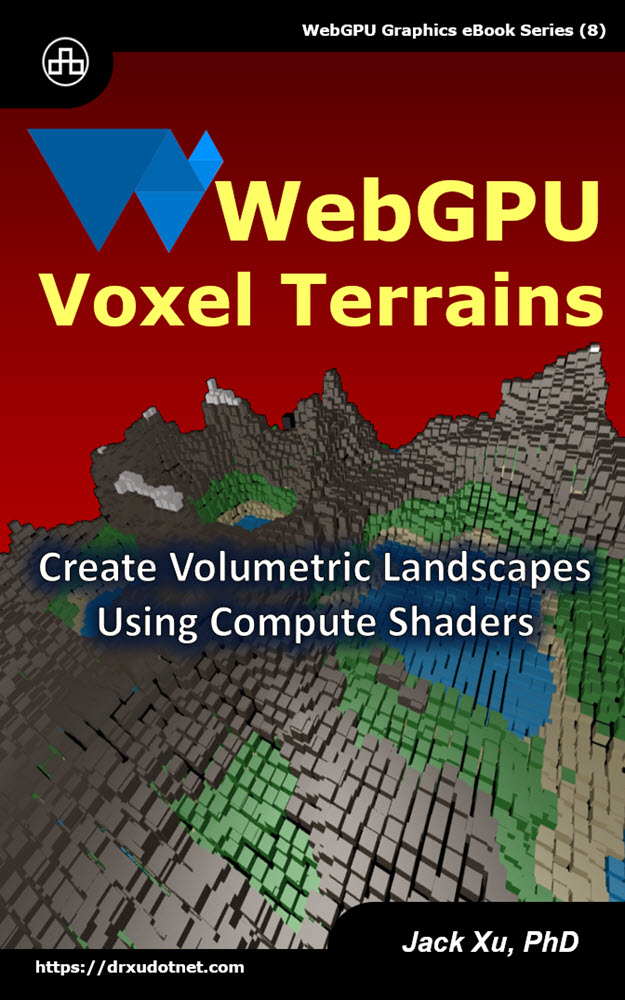

# WebGPU Voxel Terrains 
## Create Volumetric Landscapes Using Compute Shaders

This is a source code of example projects contained in the eBook ["WebGPU Voxel Terrains"](https://www.amazon.com/exec/obidos/ASIN/B0CH1PM4S5/unicadinccom-20). 

<p align="center">
<a href="https://drxudotnet.com"></a>
</p>

## Getting Started

After cloning the repository run

```
npm install
```

to install webpack and other npm packages, then you can run the serve task and point your browser to `localhost:8080`:

```
npm run serve
```

You can also compile this sample in different modes with the following commands:

In the development mode:
```
npm run dev 
```

In the production mode:
```
npm run prod
```

Or in the watch mode:
```
npm run watch 
```

